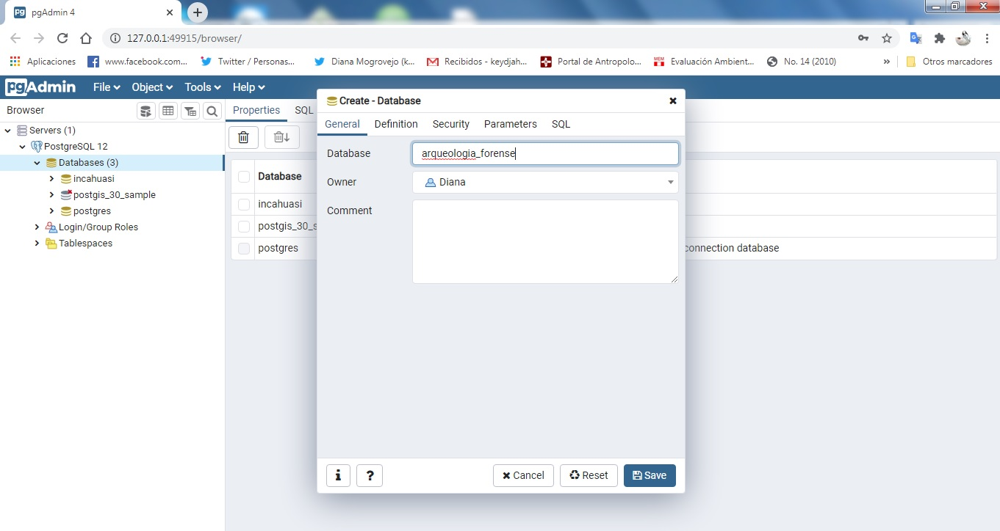
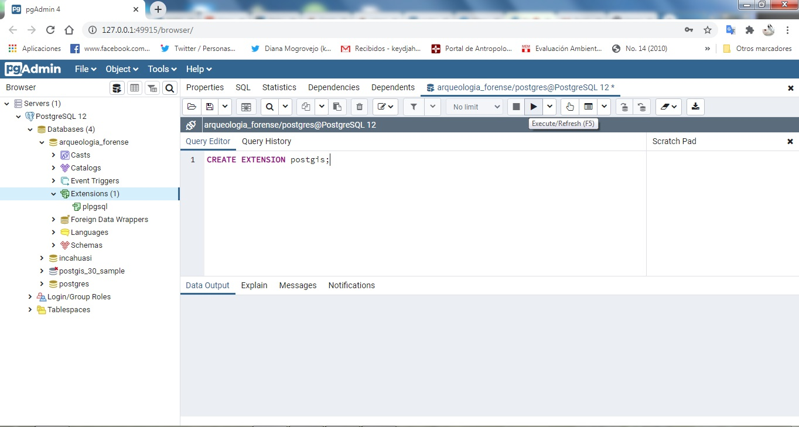
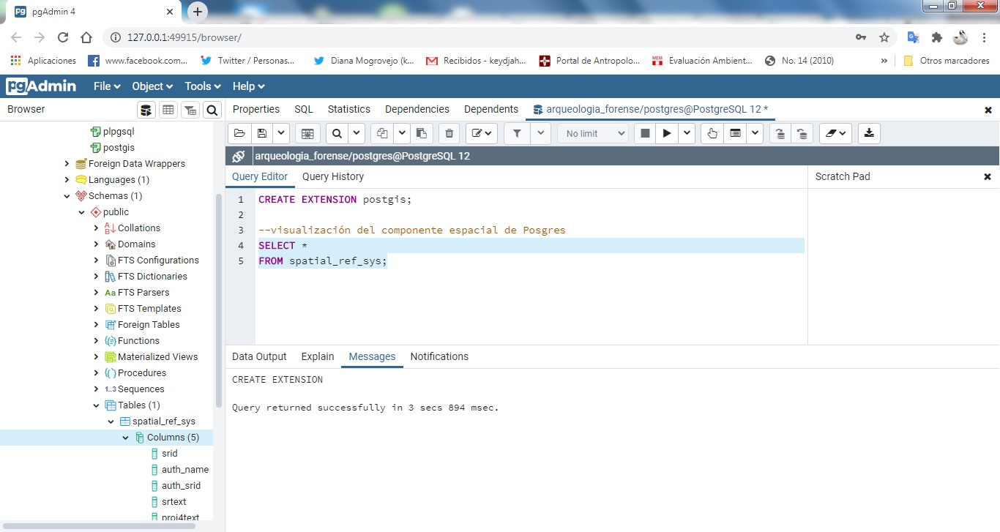
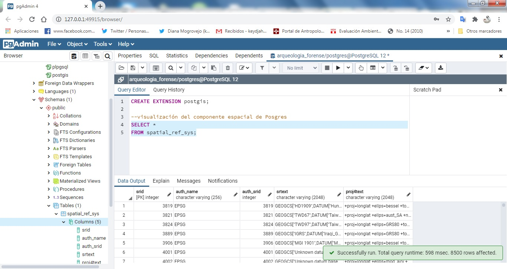
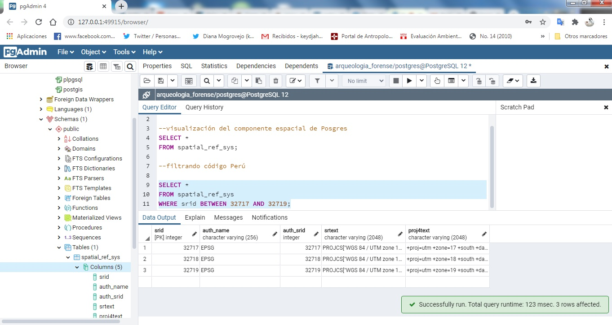

## Extensión PostGIS en PostgreSQL

    1.Abrir pgAdmin
    2.Crear un base de datos haciendo click derecho en
    el ícono de Databases>create>Databases
    3.Nombrar la base de datos que requiera
    en nuestro caso: **arqueologia_forense**

    2.Click en el ícono "query tool"
    3.Copiar el siguiente código y darle *Execute*!:

    CREATE EXTENSION postgis;

    4.Ya podemos empezar a explorar los beneficios de PostGis!
    5.Visualizaremos el componente espacial que viene por defecto.

    6.Podemos poner en práctica un poco de SQl para la visualización de código EPSG, sino recuerdas cómo, puedes ver [1]

 [1][Sentencias SQL](https://github.com/barja8/SQL4Geographers/blob/master/Script/02PrimerasSentencias.sql)
