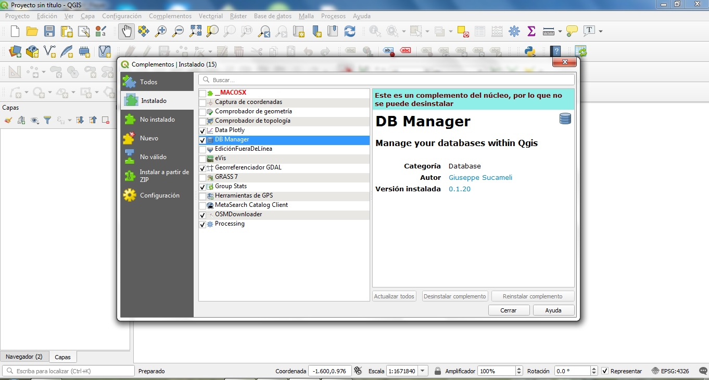
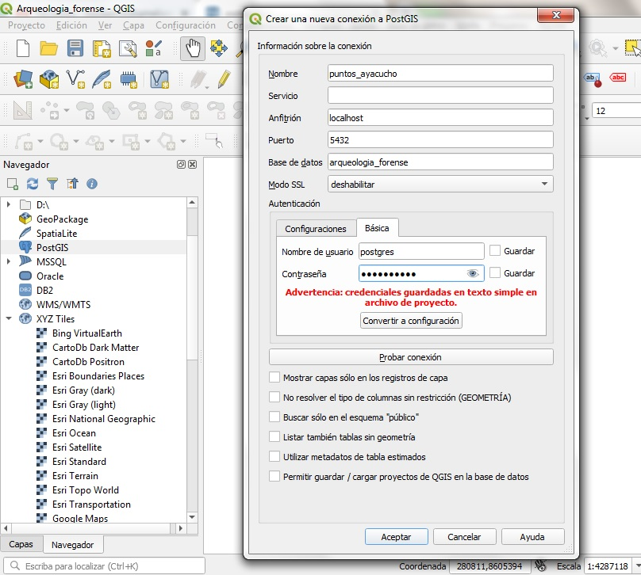
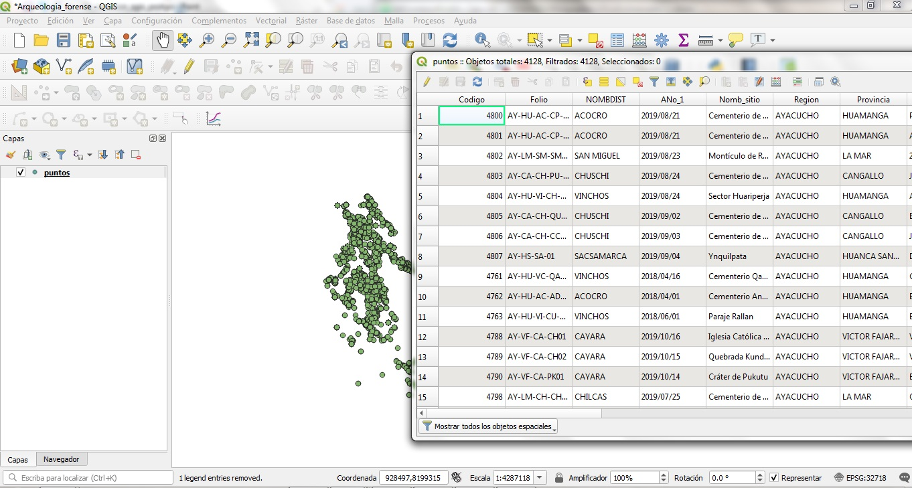
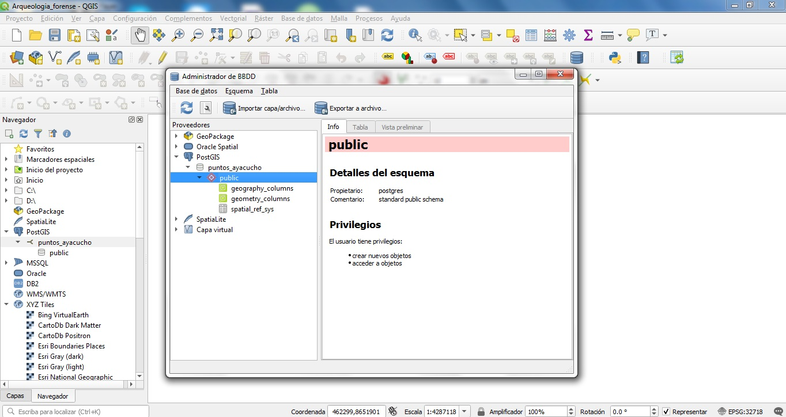
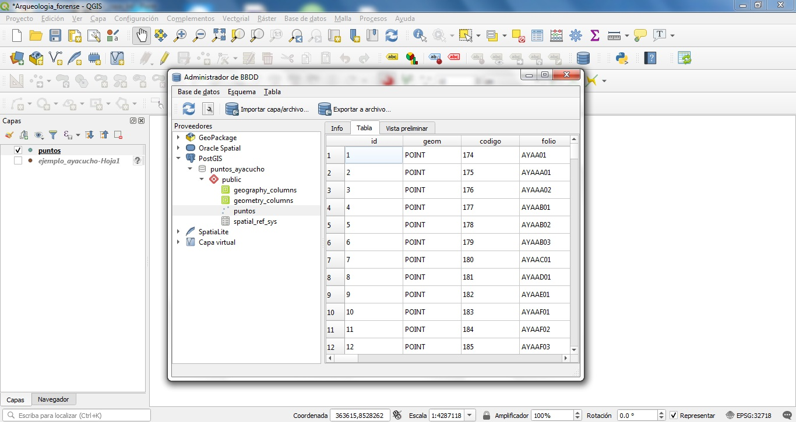
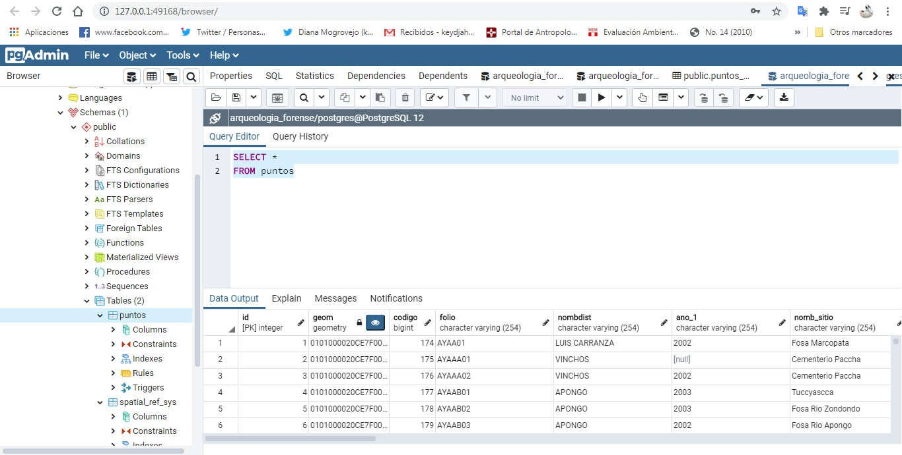
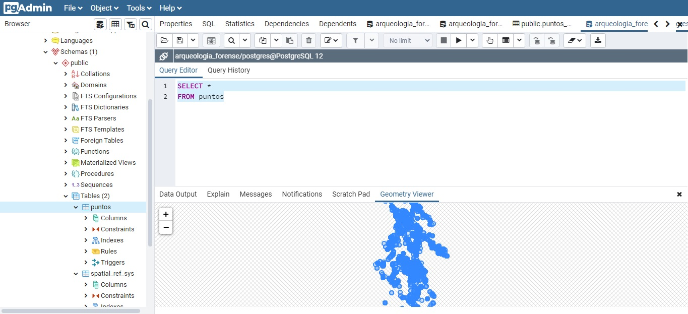

## Conexión de PostGis desde Qgis

    1.Abrir Qgis y asegurarnos de tener el complemento DB Manager activado.

    2.Nos dirigimos al navegador de Qgis, y clickeamos en el ícono PostGIS>Conexión nueva

    3.Completamos la información dándole nombre a la tabla que quieres conectar, en nuestro caso la llamaremos 'puntos_ayacucho'. Recordamos antes, que habíamos creado una base de datos en Postgres llamada 'arqueologia_forense', pues la base en Qgis se contectará a esta última finalmente ;). Así que recomendamos tener abierto también Pg Admin (Postgres). Los datos que empezaremos a completar son los siguientes:

* nombre: *el que quieras*
* Anfitrión: localhost
* Puerto: 5432
* Base de datos: arqueologia_forense
* Nombre de usuario: *el que colocaste en Postgres*
* Contraseña: ídem! - te recomiendo apuntarlas, sino no conectará -
* Por último, puedes escoger entre la opciones en la parte inferior (como 'Buscar solo en esquema público') o dejarlo en blanco.

    4.Tener lista la capa vectorial en Qgis que será exportada a la base de datos, en nuestro caso la capa 'puntos' hacia 'puntos_ayacucho'.

    5.Existen varios modos para agregar una capa vectorial en una base de datos, en nuestro caso escogemos dar click en el ícono 'Administrador de base de datos'>importar capa/archivo>aceptar

    6.Nos dirigimos al navegador de Qgis y ver que la capa 'puntos' ha sido agregada a la base de datos, y a su vez, en Postgres - haciendo refresh- podemos ver la capa 'puntos' en la base de datos 'arqueologia_forense' - tanto la vista de la tabla y su distribución espacial!-

*nota: en el siguiente capítulo (03), veremos como agregar un basemap a los puntos en Postgre!*
