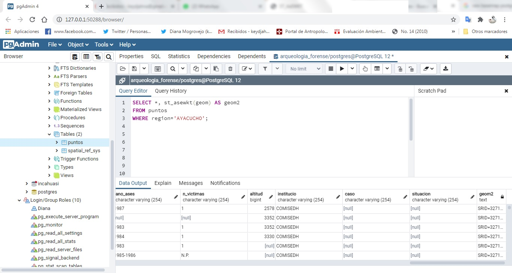
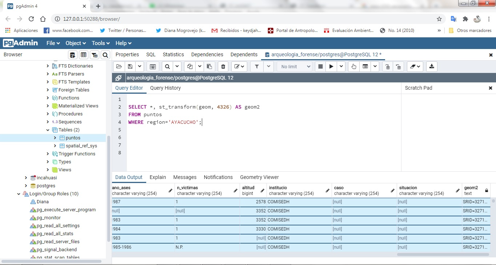
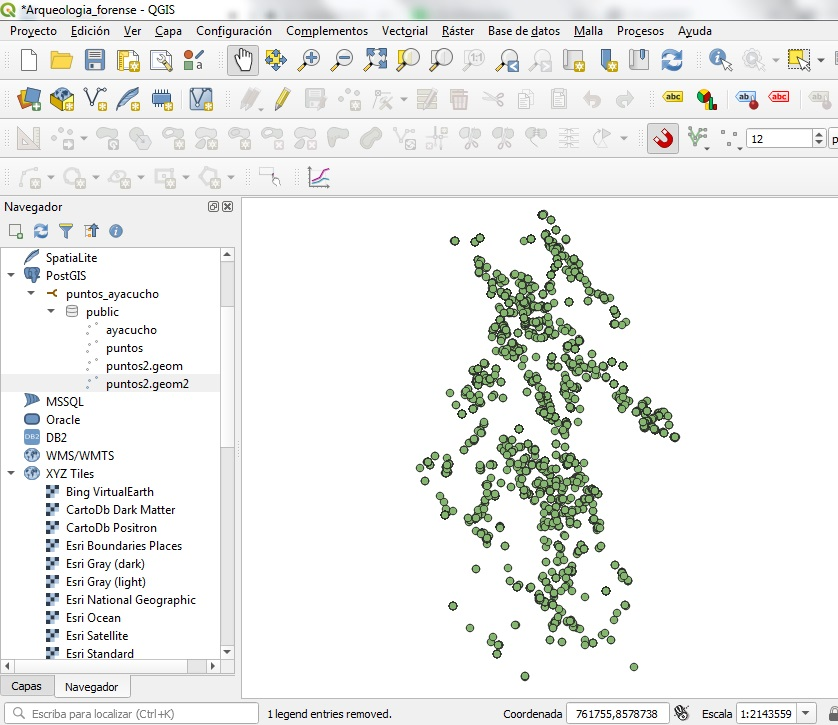
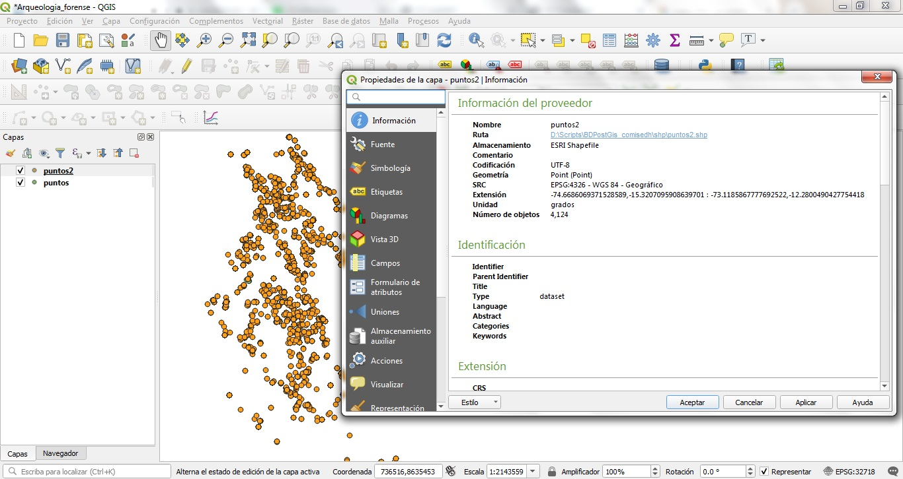
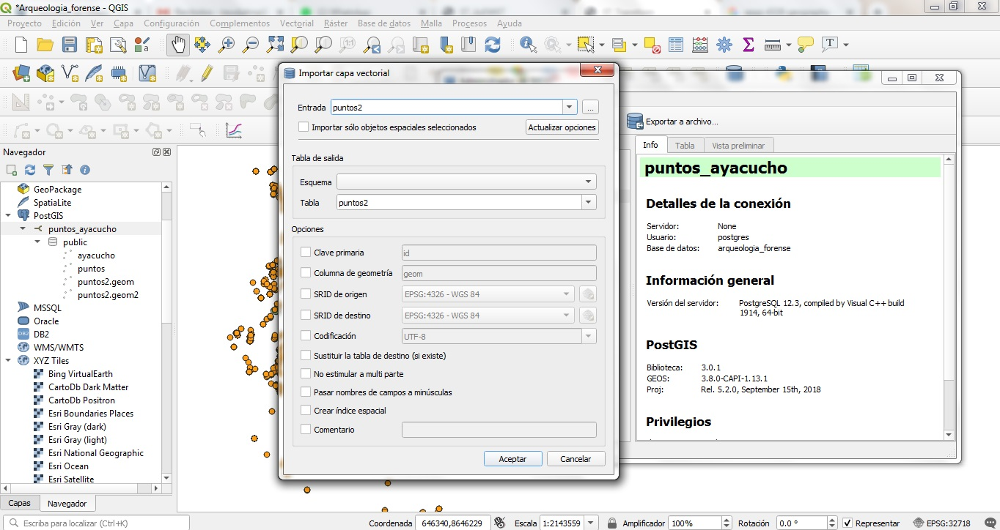
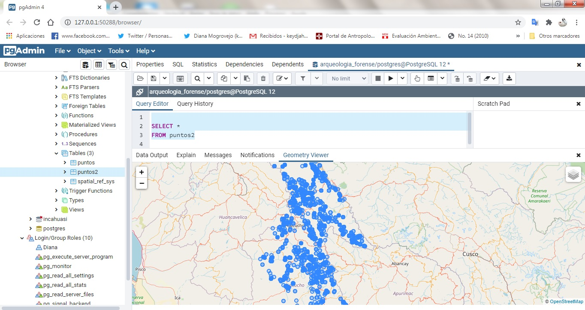

## Visualización del mapa base en PostGIS

    1.Necesitaremos devolver la representación WKT a la
    geometría prefijada SRID. Para ello utilizaremos
    la capa 'puntos', especificando alguna característica
    en este caso la 'región'.

    2.Convertiremos en una nueva geometría según
    la requerida, en nuestro caso el EPSG:4326.
       

    3.Actualizamos el archivo en Qgis, y lo volvemos a
    cargar en la base como shape denominado 'puntos2'

    4.Llevar el shape a la base de datos!

   

    5.Actualizar tabla en PostgreSQL  y ver tabla Puntos2.

*Este es uno de los modos, usando Qgis!*
