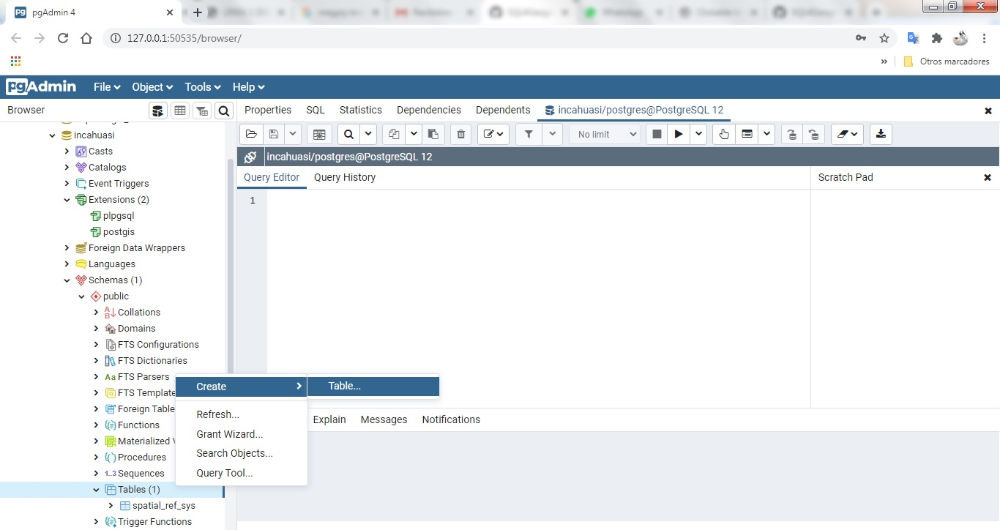
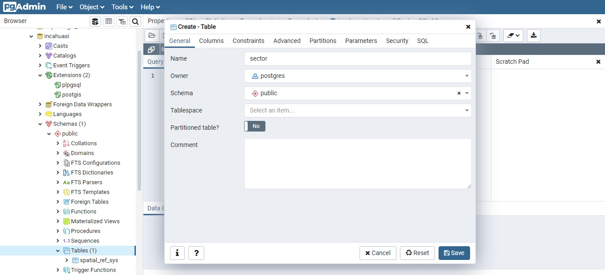
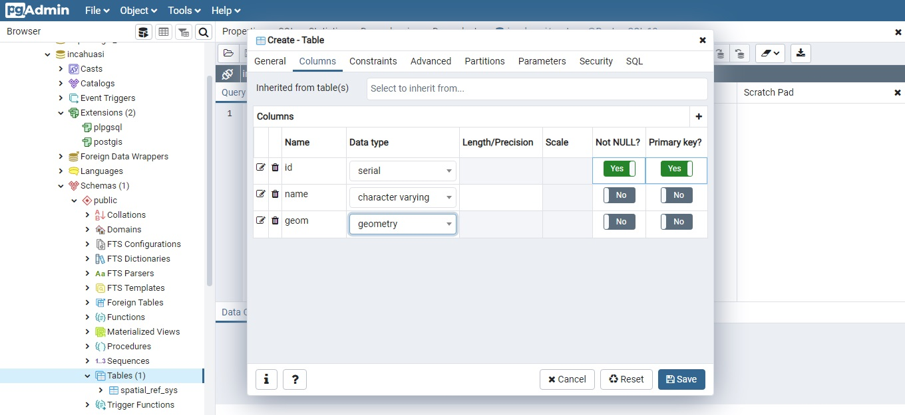
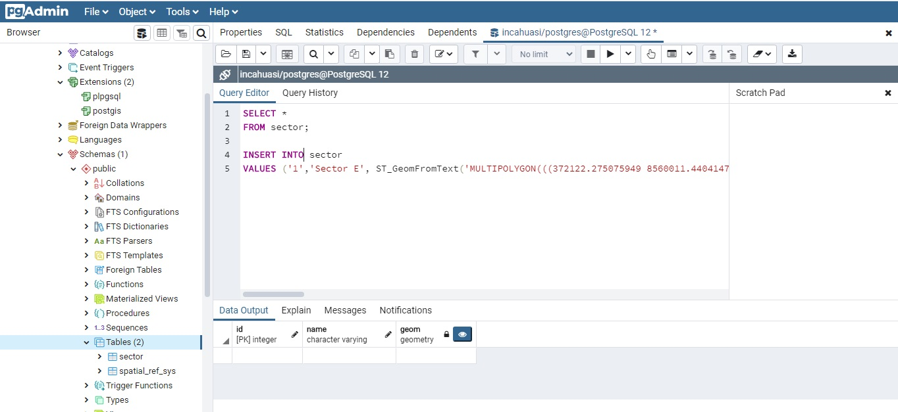
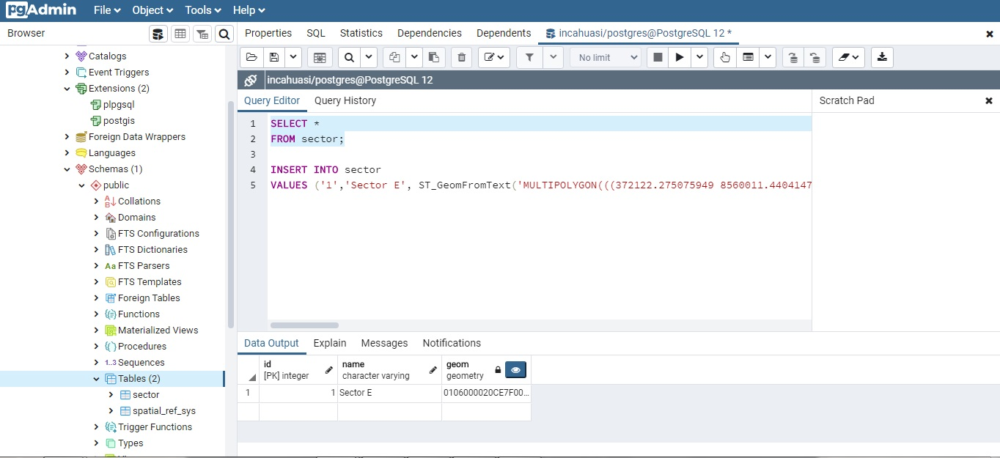
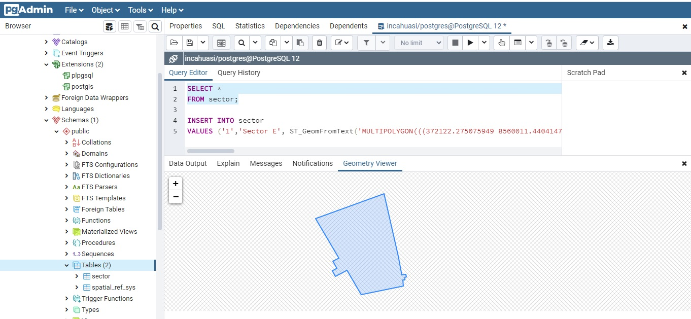

## Creación de tabla con datos espaciales

    1. Usaremos la interfaz de pgAdmin 4
    2. Crearemos una base de datos,como mostramos en [1], la llamaremos Incahuasi,
     debido a que nos interesa en este caso ver la ubicación geográfica
     de un sector de este sitio arqueológico.

    3. Colocamos nombre a la tabla, nosotros le pondremos 'Sector'. No olvidar señalar
    el propietario y el nombre del esquema, nosotros lo dejaremos en 'público'.

    4. Pasamos a la sección columnas y agregamos tres campos: id, name y geom.
    'id' será el campo con la llave primaria y por lo tanto no debe ser nulo. Y guardar!

    5.Ahora -la parte emocionante- colocaremos datos a la tabla.
    Para ello usaremos código SQL. Nosotros agregaremos el Sector E (id, nombre) y señalamos
    que este corresponde a un multipolígono, pues paulatinamente agregaremos
    más polígonos (subsectores) dentro de este y así explorar más de las geometrías.
    Respecto al código podemos ir a [2] para refrescar la memoria.

    6.Correr el código, y luego volver
    a seleccionar los datos la tabla sector
    con Selec.
  

*Y lo visualizamos en el geometry viewer!*

Nota:

Aquí los tipos de geometrías

* Point(0 0)
* Linestring (0 0, 1 1, 1 2)
* Polygon (0 0, 4 0,4 4,0 4, 0 0),(1 1,2 1,2 2, 1 2, 1 1)
* Multipoint((0 0), (1 2))
* Multilinestring((0 0,1 1,1 2),(2 3,3 2,5 4))
* Multipolygon(((0 0,4 0,4 4,0 4,0 0),(1 1, 2 1,2 2,1 2,1 1)),((-1 -1,-1 -2,-2 -2,-2 -1, -1 -1)))
* Geometrycollection(Point(2,3),Linestring(2 3,3 4))

Es necesario que estas geometrías incluyan un sistema espacial de referencia conocido como SRID. También debemos tener en cuenta el formato, podrían ser WKT o WKB. Acotamos que nuestros datos son de naturaleza WKT con SRID : 32718 (UTM WGS84 Zona 18S). Esta información la podemos revisar con mayor detalle en [3].

  [1] [Crear database](https://github.com/barja8/SQL4Geographers/blob/master/PostGisExamples/01PostGisExtension.md)

  [2] [Editando la tabla](https://github.com/barja8/SQL4Geographers/blob/master/Script/02PrimerasSentencias.sql)

  [3] [Objetos GIS](https://postgis.net/documentation/): pág. 44
