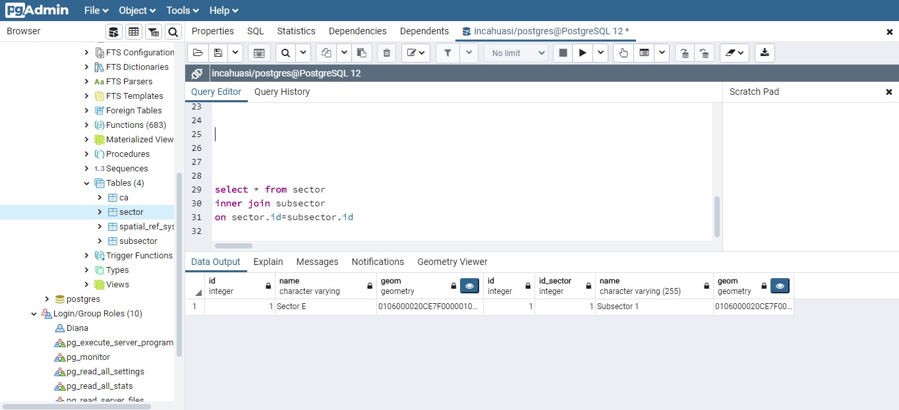
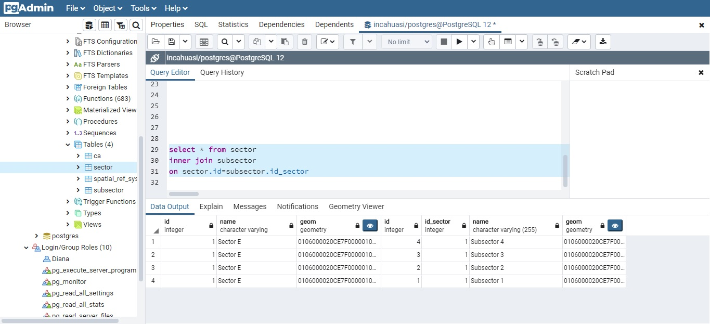

## Consultas SQl: Unión de datos

    1.Primero, podemos empezar a unir datos definiendo las tablas que trabajaremos
    usando la instrucción Select. Nosotros usaremos las tablas 'sector' y 'subsector'.

    select * from sector
    select * from subsector;
#### *Inner join*

     2.La cláusula 'inner join' es la más importante de las sentencias 'join',
     debido que se esta solo presentará como resultado los datos que cumplen con la
     condición de la selección.

    3.Tener en cuenta que si ambas tablas están correctamente enlazadas
    por una relación de clave externa (foreign key), podemor relacionar información
    mayor del siguiente modo:

    select * from sector
    inner join subsector
    on sector.id=subsector.id_sector

  *Unir colummnas de distintas tablas nos será de mucha ayuda para realizar consultas!*
