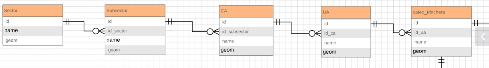
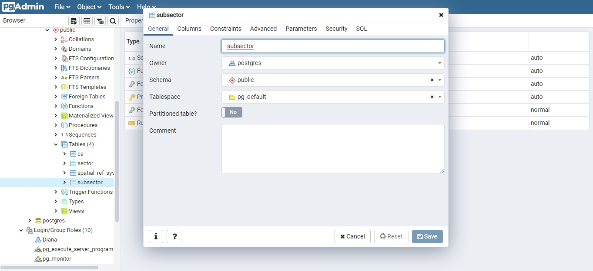
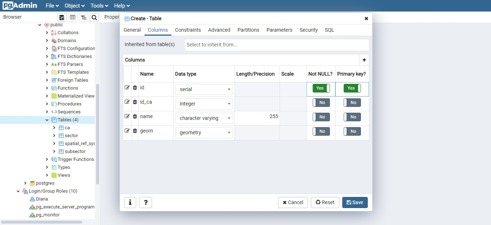
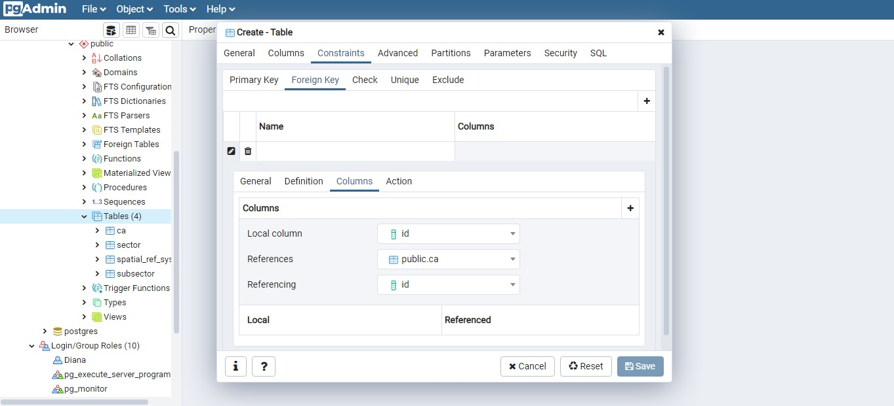
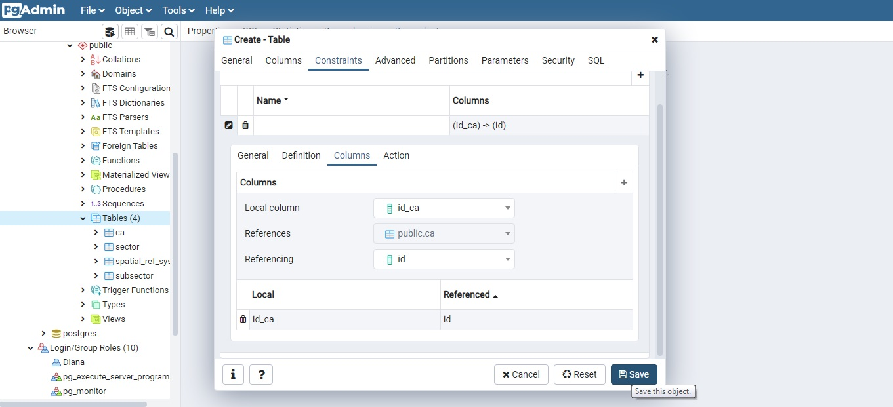

## Relacionando tablas con PostGIS!

    1.En nuestro caso estamos en proceso de crear diferentes tablas
    con información espacial. Para empezar a relacionar tablas,
    podemos crear previamente un diagrama del siguiente modo.

     2.En el gráfico podemos ver que las llaves foráneas han
     sido definidas como id_sector, id_subsector, y
     así sucesivamente. Teniendo claro el concepto de relación entre tablas,
     nos dirigimos a abrir el administrador pgAdmin y
     empezamos a trabajar sobre nuestra base de datos Incahuasi.

    3.Como ya hemos creado las tablas: Sector, Subsector, ca, vamos
    a seguir con la creación de la tabla 'ua'(que quiere decir: Unidad arquitectónica,
    según el estudio que estamos haciendo a un sitio arqueológico). Definimos nuestros
    campos, que incluye la llave principal de la tabla que además no debe ser nula.

     4.Nos dirigimos a Constraints>Foreign Key>Edit row(ícono lápiz)>
     columns. En local column, especificamos el campo id_ca,
     luego señalamos la referencia a la tabla, nosotros
     según el diagrama debemos indicar que esta tabla 'ua' se relacionará
     con la tabla 'ca' (conjunto arquitectónico) a través de su propio
     id. Es decir las unidades arquitectónicas se encontrarán
     dentro de conjuntos arquitectónicos específicos.

    5.Finalmente, click en add new row (símbolo +S), donde se visualizarán
    los campos vinculados y guardar!

