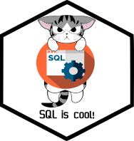

# Introducción a SQL para Geográfos

# Equipo ✨

<!-- Contribuidores -->

<!-- END -->

<table>
  <tr>
    <td align="center"><a href="http://barja8.github.io"> <b>Antony Barja</b></a> <a href="#maintenance-hamelsmu" title="Maintenance">🐧</a></td>

<td align="center"><a href="https://github.com/LBautistaB13"> <b>Lesly Bautista</b></a> 🐱</a></td>

<td align="center"><a href="https://github.com/deygurc"> <b>Deygur Canchari</b></a> 🛰️</td>
</table>
Este repositorio ha sido creado con la finalidad de consolidar nuevos aprendizajes y transmitir conocimientos a todos los que esten interesados en intruirse en los conceptos básicos de la sintaxis de **SQL** 
, está misma es compartida por muchos tipos de bases de datos, como **PostgreSQL**, **MySQL**, **SQLite**, **SQL Server** y **Oracle**; algunos de ellos enfocado especialmente en la gestión de bases de datos espaciales, aquí encontrarás todo lo necesario para comenzar una nueva aventura de amaestramiento enfocado en las consultas de "bases de datos relacional"; finalmente
en la parte inferior encontrarás una serie de referencias alternativas que podrían complementar tu ruta de aprendizaje.

# Objetivos:
 - Aprender la sintaxis básica de **SQL** y la estructura de las bases de datos relacional.
 - Realizar operaciones comunes en **SQL** que incluyen ordenar, filtrar, calcular valores, agregar, combinar datos y limpiar datos.
 - Crear una base de datos en **PostgreSQL** y realizar consultas 
 - Crear una nueva base de datos espaciales en **PostgreSQL** y trabajar con **PostGIS**.
 - Comprender la diferencia entre consultas de atributos y consultas de geometría.
 - Trabajar una base de datos de **PostgreSQL** con la interfaz gráfica de usuario (GNU) de **QGIS**.
 - Crear capas y tablas virtuales en **QGIS** usando  comandos de SQL.
 - Usar la interfaz de desarollo (IDE) de **Rstudio** para hacer consultas espaciales. 

## PlayList de SQL4Geographers

## Referencias utilizadas:
- *Michele Tobias,**Spatial SQL with SpatiaLite**,(2019),repositorio de GitHub,https://github.com/MicheleTobias/Spatial_SQL*
  
- *CARTO,**Geospatial Databases**,(2018),repositorio de GitHub,https://github.com/CartoDB/carto-workshop/tree/master/04-database*
  
- *Fred Lott,**Spatial SQL workshop materials for CUGOS Fall Fling 2019**,(2019),repositorio de GitHub,https://github.com/flott/sql_workshop_cugos19*
  
- *Ben Spaulding,**SpatialSQLfortheGeographer**,(2018),repositorio de GitHub,https://github.com/bspauld/SpatialSQLfortheGeographer*
  
- *Michele Tobias,**Intro to SQL for Querying Databases**,(2019),repositorio de GitHub,https://github.com/MicheleTobias/Workshop-SQL*
  
- *DataCamp,**Introduction to SQL by Nick Carchedi**,(2019), repositorio de GitHub, https://github.com/datacamp/courses-introduction-to-sql*

- *Alex Singleton,**urban_analytics**,(2017),repositorio de GitHub,https://github.com/alexsingleton/urban_analytics/tree/master/03_Basic_SQL*  

Todos los datos producidos en el presente proyecto se publican bajo [licencia Creative Commons (CC BY 4.0 IT)](https://creativecommons.org/share-your-work/): Es posible reproducir, distribuir, transmitir y adaptar libremente datos,  también con fines comerciales, siempre que se cite la **fuente**.
