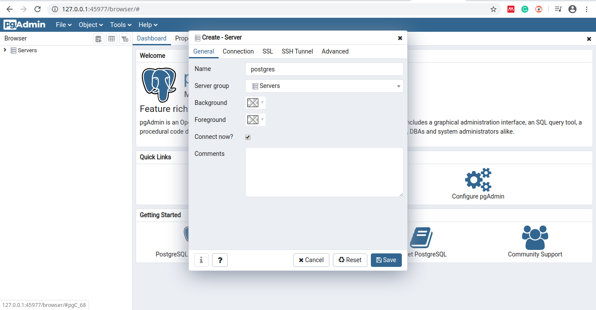
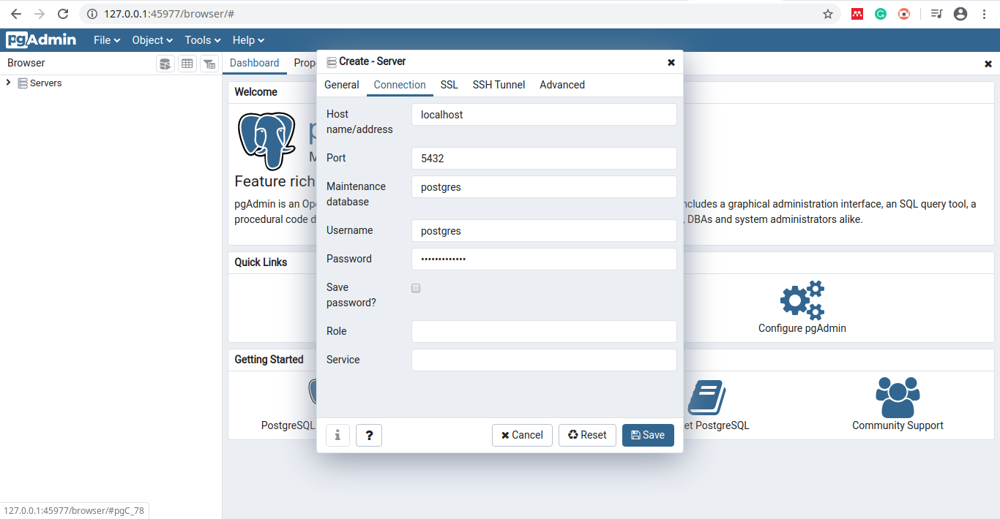

# Instalación de softwares en GNU/Linux

### Autor : <a href= 'https://barja8.github.io/'>Antony Barja</a>

Un procedimiento indispensable para poder cumplir con todo los objetivos planteados en este repositorio es la instalación de softwares con la cual vamos ir trabajando y resolviendo algunos ejercicios planteados durante las respectivas sesiones,  para poder obtener los mismos resultados 
es importante tener los mismos softwares con las mismas configuraciones y la base de datos con la cual vamos trabajar las diferentes combinaciones de comandos **SQL**.

Como primeros pasos vamos a proceder a instalar los respectivos softwares: 

* [**VisualCode**](https://code.visualstudio.com)
* [**PostgreSQL**](https://www.postgresql.org)
* [**PostGIS**](https://postgis.net)
* [**PgAdmin**](https://www.pgadmin.org) 
* [**QGIS**](https://qgis.org/es/site/) 

# VisualCode 
VisualCode es un ligero pero poderoso editor de código multiplataforma (Windows, macOS, GNU/Linux) que posee un gran ecosistemas de extensiones para dar soportes a varios tipos de lenguajes de programación y de desarrollo web, entre ellas destaca **Python**, **R**, **Html**, **Css**, **JavaScript**, **Node.js** ,**Go**, entre otros.

# Instalación de VisualCode
Para poder instalar VisualCode en **GNU/Linux**, primero tenemos que saber la distribución con la cual estamos trabajando, para esto nos dirigimos hacia la consola y editamos el siguiente comando:

```
antony$antony:~$ cat /etc/*-release
```

```
DISTRIB_ID=Ubuntu
DISTRIB_RELEASE=19.10
DISTRIB_CODENAME=eoan
DISTRIB_DESCRIPTION="Ubuntu 19.10"
NAME="Ubuntu"
VERSION="19.10 (Eoan Ermine)"
ID=ubuntu
ID_LIKE=debian
PRETTY_NAME="Ubuntu 19.10"
VERSION_ID="19.10"
HOME_URL="https://www.ubuntu.com/"
SUPPORT_URL="https://help.ubuntu.com/"
BUG_REPORT_URL="https://bugs.launchpad.net/ubuntu/"
PRIVACY_POLICY_URL="https://www.ubuntu.com/legal/terms-and-policies/privacy-policy"
VERSION_CODENAME=eoan
UBUNTU_CODENAME=eoan

```
Una vez identificado el tipo de distribución procedemos a instalar el software mediante los siguientes comandos: 

```
sudo apt update
sudo apt install software-properties-common apt-transport-https wget
wget -q https://packages.microsoft.com/keys/microsoft.asc -O- | sudo apt-key add -
sudo add-apt-repository "deb [arch=amd64] https://packages.microsoft.com/repos/vscode stable main"
sudo apt install code
```
Finalmente para comprobar que la instalación fue exitosa procedemos iniciar el software cómo se muestra en la siguiente pantalla.


# PostgreSQL - PostGIS

**PostgreSQL** es un potente sistema de gestión de base de datos relacional orientado a objetos de código abierto con más de 30 años de desarrollo activo.

**PostGIS** es un extención PostgreSQL que da soporte al manejo de datos geográficos, permitiendo que las consultas de ubicación se ejecuten mediante comandos de SQL.

# Instalación de PostgreSQL-PostGIS

Para poder instalar PostgreSQL y PostGIS, primero debemos verificar si versión de ambos software están disponibles para el tipo de distribución de GNU/Linux que estamos utilizando, para esto puedes encontrar más detalle en el siguiente enlace [clic aquí](https://ubuntu.pkgs.org/19.10/ubuntu-universe-i386/postgresql-11-postgis-2.5-scripts_2.5.3+dfsg-1_all.deb.html). 

Para nuestra distribución de Ubuntu solo tenemos que emplear los siguientes comandos:

```
 sudo apt-get update
 sudo apt-get install postgresql-11-postgis-2.5-scripts
```
Para verificar que la instación fue correcta procedemos a tipear los siguientes comandos

```
psql --version
```
```
sudo -i -u postgres
createuser postgis_test
createdb postgis_db postgis_test
psql -d postgis_db
postgis_db=# CREATE EXTENSION postgis;
postgis_db=# SELECT PostGIS_version();
```

# PgAdmin

**PgAdmin** es una plataforma de administración y desarrollo de código abierto para PostgreSQL

# Instalación de PgAdmin

```
sudo apt-get install wget ca-certificates
wget --quiet -O - https://www.postgresql.org/media/keys/ACCC4CF8.asc | sudo apt-key add -

sudo sh -c 'echo "deb http://apt.postgresql.org/pub/repos/apt/ `lsb_release -cs`-pgdg main" >> /etc/apt/sources.list.d/pgdg.list'
```
```
sudo apt-get update
sudo apt install pgadmin4 pgadmin4-apache2
```
*Observación: Si olvidas cual es tu password de tu cuenta de postgres con este comando puedes crear una nueva contraseña*
```
sudo passwd postgres
```
Finalmente para verificar que la instalación fue exitosa procedemos abrir el software





# QGIS 
QGIS es un software de Sistema de Información Geográfica libre y de codigo abierto orientado al manejo, análisis, edición y representación de datos espaciales.

# Instalación de **QGIS 3.X**

La instalación de QGIS va a depender del tipo de distribución GNU/Linux con la cual estamos trabajando, para nuestro caso es **Ubuntu 19.10 eoan**, entonces para instalar **QGIS** sólo debemos emplear los siguientes comandos:

 ```
 sudo nano /etc/apt/sources.list
 ```
```
deb     https://qgis.org/ubuntu eoan main
deb-src https://qgis.org/ubuntu eoan main
```

```
wget -O - https://qgis.org/downloads/qgis-2019.gpg.key | gpg --import
gpg --fingerprint 51F523511C7028C3
gpg  - exportar  - armadura  51 F523511C7028C3  |  sudo  apt - key  add  -
```

```
sudo apt-get update
sudo apt-get install qgis qgis-plugin-grass
sudo apt install saga 
```
Para verificar que la instalación fue exitosa procedemos a iniciar QGIS


