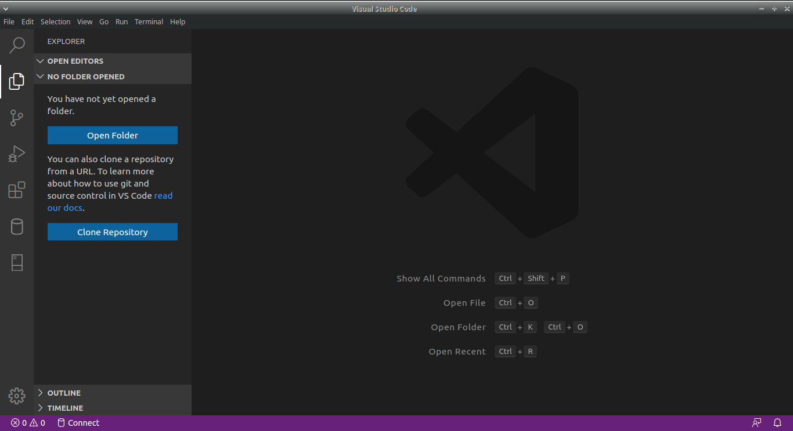

# Instalación de softwares en GNU/Linux

### Autor : <a href= 'https://barja8.github.io/'>Antony Barja</a>

Un procedimiento indispensable para poder cumplir con todo los objetivos planteados en este repositorio es la instalación de softwares con la cual vamos ir trabajando y resolviendo algunos ejercicios planteados durante las respectivas sesiones,  para poder obtener los mismos resultados 
es importante tener las mismas configuraciones y la misma base de datos con la cual vamos trabajar las diferentes combinaciones de comandos **SQL**.

Como primeros pasos vamos a proceder a instalar los respectivos softwares: 

* [**VisualCode**](https://code.visualstudio.com)
* [**PostgreSQL**](https://www.postgresql.org)
* [**PostGIS**](https://postgis.net)
* [**Pgadmin**](https://www.pgadmin.org) 
* [**QGIS**](https://qgis.org/es/site/) 

# VisualCode 
VisualCode es un ligero pero poderoso editor de código multiplataforma (Windows, macOS, GNU/Linux) que posee un gran ecosistemas de extensiones para dar soportes a varios tipos de lenguajes de programación y de desarrollo web, entre ellas destaca **Python**, **R**, **Html**, **Css**, **JavaScript**, **Node.js** , entre otros.

# Instalación de VisualCode
Para poder instalar VisualCode en **GNU/Linux**, primero tenemos que saber la distribución con la cual estamos trabajando, para esto nos dirigimos hacia la consola y editamos el siguiente comando:

```
antony$antony:~$ cat /etc/*-release
```

```
DISTRIB_ID=Ubuntu
DISTRIB_RELEASE=19.04
DISTRIB_CODENAME=disco
DISTRIB_DESCRIPTION="Ubuntu 19.04"
NAME="Ubuntu"
VERSION="19.04 (Disco Dingo)"
ID=ubuntu
ID_LIKE=debian
PRETTY_NAME="Ubuntu 19.04"
VERSION_ID="19.04"
HOME_URL="https://www.ubuntu.com/"
SUPPORT_URL="https://help.ubuntu.com/"
BUG_REPORT_URL="https://bugs.launchpad.net/ubuntu/"
PRIVACY_POLICY_URL="https://www.ubuntu.com/legal/terms-and-policies/privacy-policy"
VERSION_CODENAME=disco
UBUNTU_CODENAME=disco
```
Una vez identificado el tipo de distribución procedemos a instalar el software mediante los siguientes comandos: 

```
sudo apt update
sudo apt install software-properties-common apt-transport-https wget
wget -q https://packages.microsoft.com/keys/microsoft.asc -O- | sudo apt-key add -
sudo add-apt-repository "deb [arch=amd64] https://packages.microsoft.com/repos/vscode stable main"
sudo apt install code
```
Finalmente para comprobar que la instalación fue exitosa procedemos iniciar el software cómo se muestra en la siguiente pantalla.




# Instalación de 
# Instalación de **QGIS 3.X**


