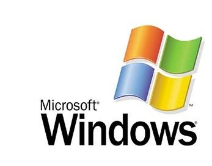
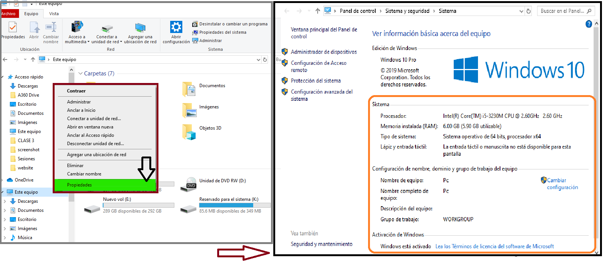
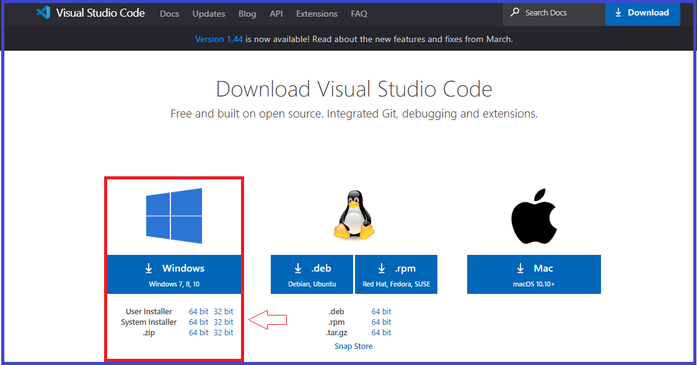
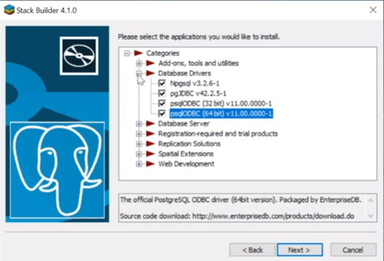

# Instalación de software en el Sistema Operativo de Windows
### Autor: <a href= 'https://github.com/deygurc/Visualcode.git'>Deygur Canchari.</a>

Un procedimiento importante para cumplir los objetivos del curso es tener instalado y configurado los software con la cual vamos a trabajar durante toda las sesiones, para ello vamos a proceder a indicar los procedemientos de instalación y configuración de estos mismos.

Los software con la cual vamos a trabajar las diferentes sentencias **SQL** son:

* [**VisualCode**](https://code.visualstudio.com)
* [**PostgreSQL**](https://www.postgresql.org)
* [**PostGIS**](https://postgis.net)
* [**PgAdmin**](https://www.pgadmin.org) 
* [**QGIS**](https://qgis.org/es/site/) 


# Visualcode

Es un ligero pero poderoso editor de código multiplataforma (Windows, macOS, GNU/Linux) que posee un gran ecosistemas de extensiones para dar soportes a varios tipos de lenguajes de programación y de desarrollo web, entre ellas destaca **Python**, **R**, **Html**, **Css**, **JavaScript**, **Node.js** ,**Go**, entre otros.

 # Instalación de visual code

Antes de comenzar a instalar cualquier software, siempre se recomienda identificar las características y propiedades de hardware con la cual estamos trabajando.
para el Sistema Operativo de Windows relizamos los siguientes procedimientos:

```
Nos dirigimos en propiedades de mi PC

```

...........remplasar


Identificado las características de nuestro sistema operativo, nos dirigimos a la pagina principal [**VisualCode**](https://code.visualstudio.com/docs/?dv=win) donde encontraremos el link de descarga para instalar el sfotware.



```
Según las especificaciones de nuestra computadora descargamos el más conveniente. Una vez descargado ejecutamos como administrador el Visualcode; para dar inicio a la instalación.
```

```
Aceptamos los acuerdos de la licencia y damos  siguiente hasta que termine la instalación.
```
Para verificar que el programa obtuvo una adecuada instalación procedemos a inciar un nuevo proyecto


## Instalación de PostgreSQL
Para adquirir el programa:
Primero tenemos que visitar su pagina https://www.postgresql.org encontraremos tanto la documentación como el programa.
podremos versiones instaladores para distintos sistemas operativos.


Empezamos la descarga "Download the installer te pedirá una confirmación de windows para ejecutar el programa aceptas.siguiente,siguiente...siguiente

```
Te solicitará que proporciones una contraseña para un usuario, generalmente pones una que vas a recordar, después le das siguiente,siguiente...siguiente, hasta finalizar.
al final te dirá que complementos quieres instalarle a tu base de datos.
```
como trabajaremos en windows marquemos estas opciones.



luego siguiente,siguiente...siguiente hasta finalizar son cuatro driver
una vez terminado ya podemos interactuar con el programa.


# QGIS

QGIS es un Sistema de Información Geográfica (SIG) de Código Abierto licenciado bajo GNU - General Public License . QGIS es un proyecto oficial de Open Source Geospatial Foundation (OSGeo). Corre sobre Linux, Unix, Mac OSX, Windows y Android y soporta numerosos formatos y funcionalidades de datos vector, datos ráster y bases de datos.
https://qgis.org/es/site/about/index.html

```
La instalación de QGIS va a depender del tipo de distribución WINDOWS con la cual estamos trabajando, para nuestro caso es 64 Bits, entonces para instalar QGIS sólo debemos emplear los siguientes comandos:
```

link de descarga: https://qgis.org/es/site/forusers/download.html


Empezamos la descarga "Download the installer" te pedirá una confirmación de windows para ejecutar el programa aceptas.siguiente,siguiente...siguiente