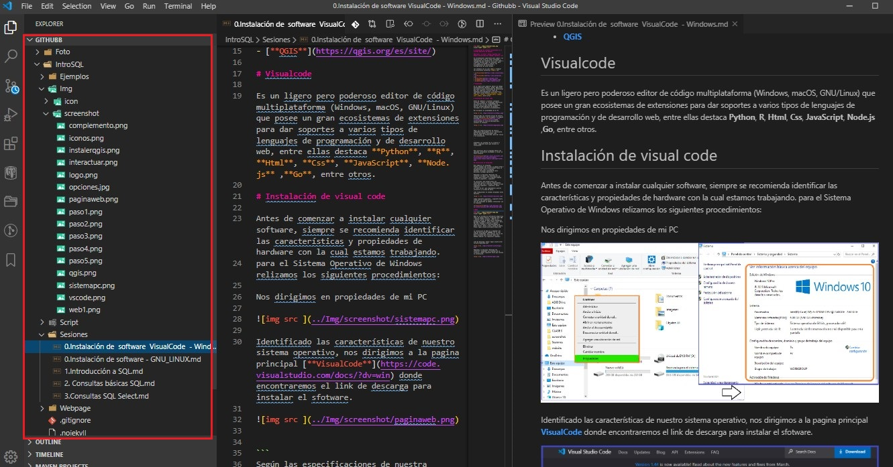

### "Autor" : <a href= 'https://github.com/deygurc'>Deygur Canchari</a>

# Consulta básica en SQL ❤

cuando nos enfrentamos ha un nuevo programa cualquiera que sea esto, nos preguntamos como debemos manipuelar los datos, como debemos escribir un codigo.

para realizar ciertas consultas en SQL se utiliza ciertos comandos de una base de datos.

#### Base de Datos: es una colección de datos, donde los datos ya toman sentido.

Así que lo primero será conocer la tabla sobre la que vamos a trabajar, dicha tabla tendrá la siguiente estructura:

```
Libros
ISBN
Titulo
Autor
Editorial
Fecha Publicación

```
Para poder realizar la consulta básica vamos a utilizar la sentencia SELECT la cual sigue la siguiente estructura:

```
SELECT campos FROM tabla
```

En el caso de la tabla utilizaremos el nombre de la tabla, es decir, Libros.De esta forma la consulta básica en SQL sobre la tabla libros quedará de la siguiente forma:

```
SELECT * FROM Libros

```

## Sentencias SQL del lenguaje de manejo de datos (DML)

* SELECT: hacer Consultas.
* INSERT : Introduce filas en las tablas de base de datos.
* UPDATE : Modifica valores en filas que ya existen.
* DELETE : Elimina filas

```
recomiendo que instales una extensión que te ayudará a visualizar los formatos en la que estás trabajando mediante un ícono.

```

