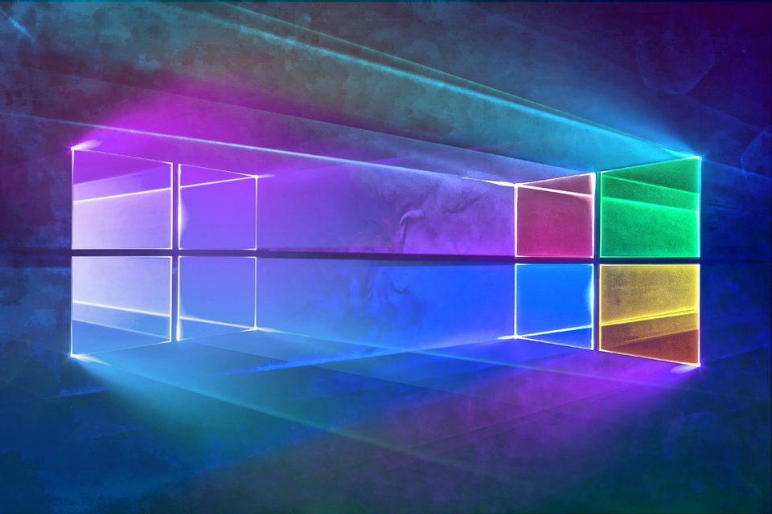
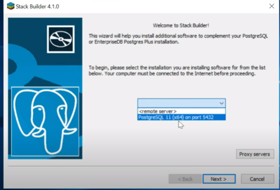
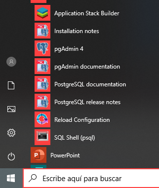

# Instalación de softwares en WINDOWS


### Autor : <a href= 'https://github.com/deygurc'>Deygur Canchari.</a>
Un procedimiento indispensable para poder cumplir con todo los objetivos planteados en este repositorio, es la instalación de softwares con la cual vamos ir trabajando y resolviendo algunos ejercicios planteados durante las respectivas sesiones;  para poder obtener los mismos resultados 
es importante tener las mismas configuraciones y la misma base de datos con la cual vamos trabajar las diferentes combinaciones de comandos **SQL**.

Como primeros pasos vamos a proceder a instalar los respectivos softwares: 

* [**VisualCode**](https://code.visualstudio.com)
* [**PostgreSQL**](https://www.postgresql.org)
* [**PostGIS**](https://postgis.net)
* [**Pgadmin**](https://www.pgadmin.org) 
* [**QGIS**](https://qgis.org/es/site/) 

# VisualCode 
VisualCode es un ligero pero poderoso editor de código multiplataforma (Windows, macOS, GNU/Linux) que posee un gran ecosistemas de extensiones para dar soportes a varios tipos de lenguajes de programación y de desarrollo web, entre ellas destaca **Python**, **R**, **Html**, **Css**, **JavaScript**, **Node.js** , entre otros.

# Instalación de VisualCode
Para poder instalar VisualCode en **WINDOWS**, primero tenemos que saber la distribución con la cual estamos trabajando, para esto nos dirigimos hacia la consola y editamos el siguiente comando:

```
DXDIAG
```

```
System Information
------------------
Machine Name: PC
Machine Id: {7CD2A321-8F39-4F65-9F84-4FE471BEF6B7}
Operating System: Windows 10 Pro 64-bit (10.0, Build 18362) (18362.19h1_release.190318-1202)
Language: Spanish (Regional Setting: Spanish)
System Manufacturer: TOSHIBA
System Model: Satellite C45-A
BIOS: InsydeH2O Version 03.72.301.20 (type: BIOS)
Processor: Intel(R) Core(TM) i5-3230M CPU @ 2.60GHz (4 CPUs), ~2.6GHz
Memory: 6144MB RAM
Available OS Memory: 6038MB RAM
Page File: 3328MB used, 4565MB available
 Windows Dir: C:\WINDOWS
DirectX Version: DirectX 12
```
Una vez identificado el tipo de distribución procedemos a instalar: 


# Nos dirigimos a la pagina
https://code.visualstudio.com/Download
Segun las especificaciones de nuestra computadora descargamos el más conveniente. Una vez descargado ejecutamos como administrador el Visualcode para dar inicio a la instalación.
```
acetamos los acuerdos de la licencia
siguiente hasta que termine la instalación
```
Finalmente para comprobar que la instalación 


# Instalación de PostgreSQL
Primero tenemos que visitar su pagina https://www.postgresql.org/
encontraremos tanto la documentación como el programa
```
podremos versiones instaladores para distintos sistemas operativos.
```

## BSD
* FreeBSD
* OpenBSD
## Linux
* Red Hat family Linux (including CentOS/Fedora/
* Scientific/Oracle variants)
* Debian GNU/Linux and derivatives
* Ubuntu Linux and derivatives
* SUSE and openSUSE
* Other Linux
## macOS
## Solaris
## Windows

```
empezamos la descarga "Download the installer ", te mostrará versiones disponibles despues de la descarga ejecutamos el instalador.
```
```
te pedirá una confirmación de windows para ejecutar el programa aceptas.siguiente,siguiente...siguiente
```
```
te solicitará que proporciones una contraseña para un un usuario generalmente pones una que vas a recordar.siguiente,siguiente...siguiente.terminar
al final te dirá que complementos quieres instalarle a tu base de datos.
```


```
como trabajaremos en windows marquemos estas opciones.
```

siguiente,siguiente...siguiente son cuatro driver

 ```
 una vez terminado ya podemos interactuar con el programa.
 ```

# Instalación de **QGIS 3.X**


